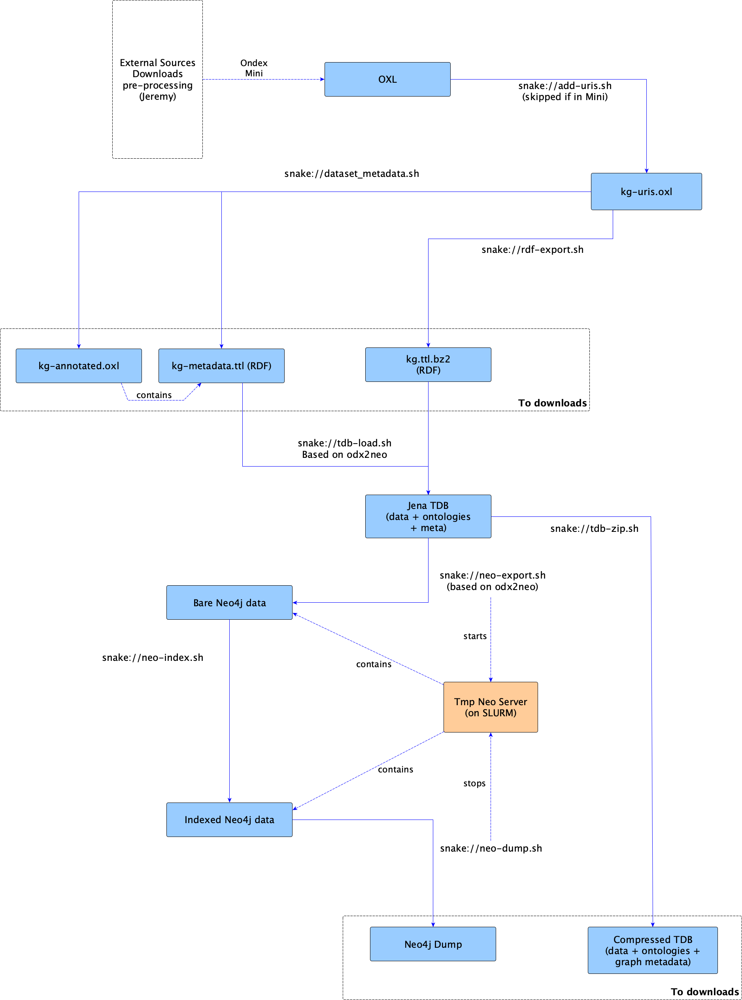
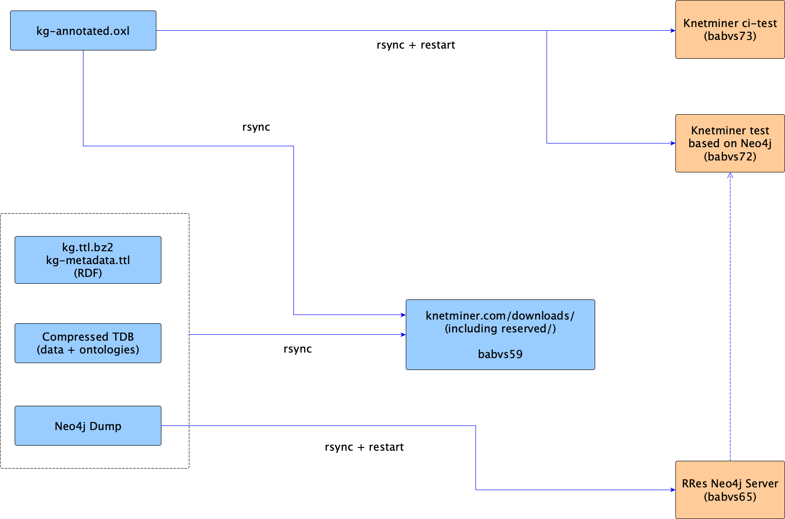

# The Knetminer Raw Data Pipelines

The script you find in the hereby folder and [/cyverse-endpoints](../cyverse-endpoints) are used to produce machine-readable data from the Knetminer datasets, when these are shipped in our custom OXL format.  

Note that files in these directories are independent on the main POM project, they're included in the same git repository due to their conceptually-similar function.


# RRes Endpoints 

For the RRes pipeline, the data are built mostly via [SnakeMake][10] and running SnakeMake steps (rules) against our SLURM cluster. The RRes environment (see below), loads SnakeMake from the available SLURM modules.

[10]: https://snakemake.readthedocs.io/en/stable/getting_started/installation.html

### How the configuration works

All the ETL scripts rely on three levels of configuration:

* **Default** config, which is set by [`default-cfg.sh`](config/default-cfg.sh). This script is also called by other ETL scripts to get three parameters: dataset_id, dataset_version, environment_id

* **Environment**: if envionment_id is given in the CLI, `default_cfg.sh` invokes [`$environment_id-env.sh`](config/environments/), [example](config/environments/rres-env.sh). These config scripts are meant to set environment-specific config, eg, paths to external tools in your particular running host. This script can override previous defaults.

Note that every dataset has also a configuration file for the OXL metadata initialiser, a tool included in the [OXL-RDF exporter][20]. This allows for adding dataset descriptors to an OXL and its RDF export. [Example][30] 

[20]: https://github.com/Rothamsted/knetbuilder/tree/master/ondex-knet-builder/modules/rdf-export-2
[30]: https://github.com/Rothamsted/knetbuilder/tree/master/ondex-knet-builder/modules/rdf-export-2/src/main/assembly/resources/knetminer-descriptors  

* **Dataset configuation**: finally, `default-cfg.sh` invokes [$dataset_id-$dataset_ver-cfg.sh](config/datasets), [example](config/datasets/poaceae-free-57-cfg.sh). Here, dataset-specific configuration, eg, OXL source for a given dataset. This script can override defaults and the environment config.

  
## The RDF/Neo4j Building Pipeline 

This is the main Knetminer raw data pipeline. It starts from an Ondex file (`.oxl`) containing a dataset, converts this custom knowledge graph format into RDF, uses the RDF to populate a Neo4j database. The pipeline's output is a set of dump files. These are used with other scripts and pipelines (see below) to do things like re-populating our data servers (Virtuoso for RDF, Neo4j) and similar tasks.

As said above, the RDF/Neo4j pipeline is based on the SnakeMake workflow system. As you can see in the [Snakemake file](build-endpoint.snakefile), the pipeline is mainly a chain of steps. We recommend that you invoke Snakemake via the [build-endpoint.sh](build-endpoint.sh) wrapper. As explained above, this requires parameters about the working dataset and the running environment.

See the Snakemake file and [single-step scripts](endpoint-steps) for details.


### Diagram



## The Servers Updating Pipeline

After the data are created by the RDF/Neo4j pipeline above, these are used to update a number of test servers in the RRes infrastructure (explained in this section), and also to update external resources in the Cyverse infrastructure
(explained in the next section).

Regarding the RRes updates, these are based on the [servers-sync.sh](servers-sync.sh) script (which doesn't require Snakemake). It contains the steps:

* Updates the data download locations at the [Knetminer web site](https://knetminer.com/downloads/), using rsync to transfer the data dumps that the pipeline above created for a working dataset.
   
* Updates the Neo4j test server for the current dataset (with the Neo4j data dump).

* Updates the test Knetminer instances that use the current dataset. As usually, these are based on Docker and this step transfers the URI-added OXL to the relevant Docker servers and re-start their containers via SSH.

Any of the above steps can be omitted, if a dataset doesn't need them. This is controlled by variables that can be unset by the dataset-specific configuration (see above). See the `servers-sync.sh` file for details. 

### Diagram

**Note**: `neo-index.sh` used to depend on `knowledge-graph-annotated.oxl` too (ie, the KG annotated with dataset metadata), in the sense that this dependency was specified in the SnakeMake file and this was the OXL that was passed to the old KnetMiner initialiser. However, the latter didn't use it, we passed such file to the old initialiser just in case of future use.

The new KnetMiner Nova-based initialiser doesn't use any OXL directly, only the Neo4j database and a bunch of config files. For this reason, we have removed the OXL dependency from this SnakeMake step.

This means that currently, the Ondex-computed metadata are only exported in the RDF files and similar metadata are computed in other ways, eg, see [this script invoked by index.sh](utils/neo4j/neo-stats.sh).




### Secrets management

For reserved data, we have directories of secrets on our file system:

```bash
# The dir where we keep secrets to be used with applications and scripts
export KNET_SECRETS="$KNET_SOFTWARE/secrets"
export KNET_WEB_SECRETS="$KNET_SECRETS/web-data"
...
secret_path="$KNET_WEB_SECRETS/$KETL_DATASET_ID-$KETL_DATASET_VERSION.key"
```
For instance, the `secret_path` at the end is an hash random code, which is appended to our web download directory, to make reserved datasets downloadable only to those who know the hash code. These dataset-download directories have to be created manually on the
destination web server for knetminer.com and of course, prior to launching the synchronisation script.

## Walk-through

For RRes-endpoint this [walk-thorugh doc](doc/pipeline-walkthrough.md), which uses a dummy dataset on our RRes hosts is available.


# CyVerse Endpoints

Part of the RDF and Neo4j dumps produced at Rothamsed are used on our CyVerse servers, in order 
to expose our data to the world, via our [SPARQL and Neo4j endpoints][100].

[100]: https://knetminer.com/data

See [here](../cyverse-endpoints) for details.
